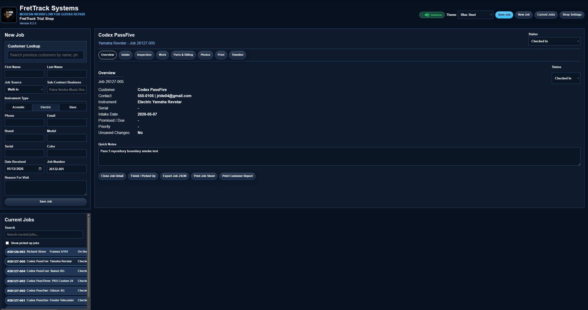
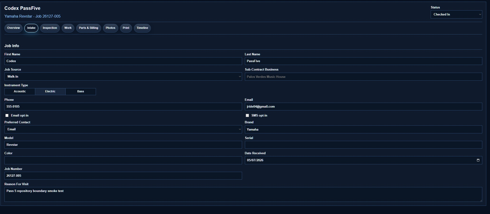
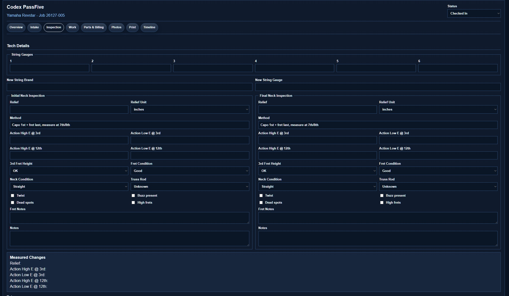
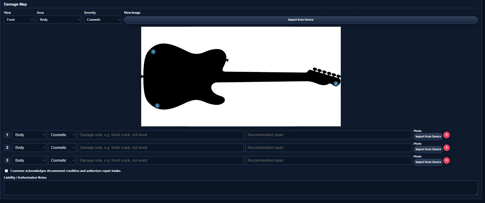
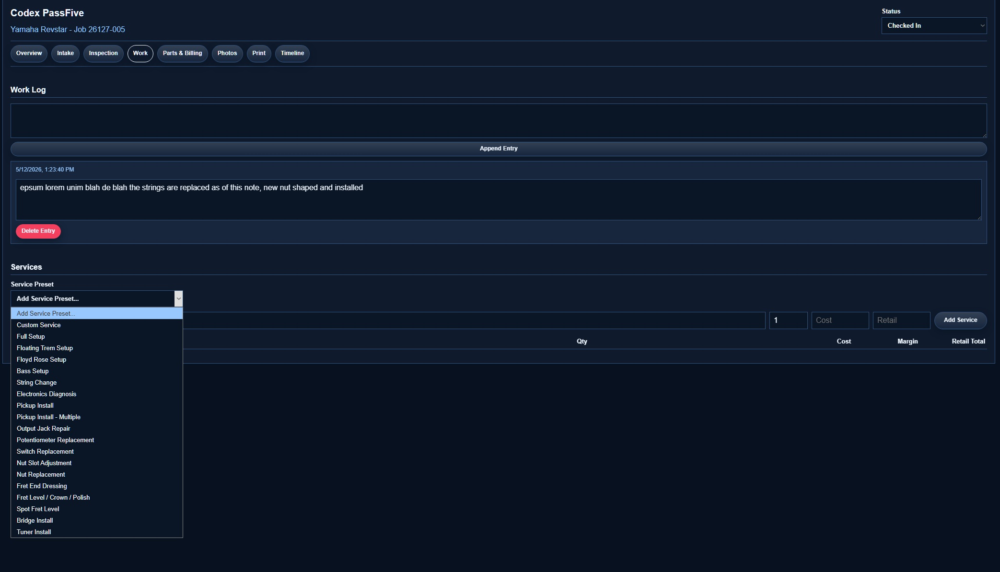
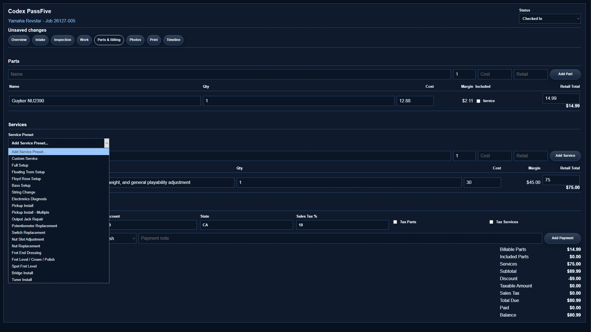
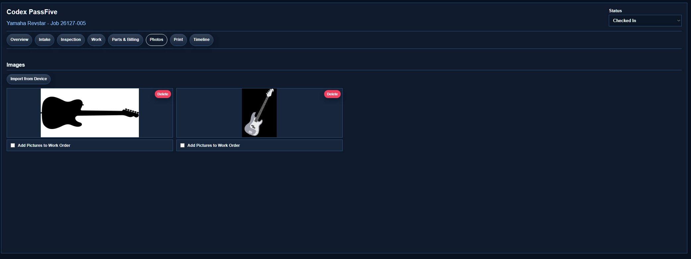
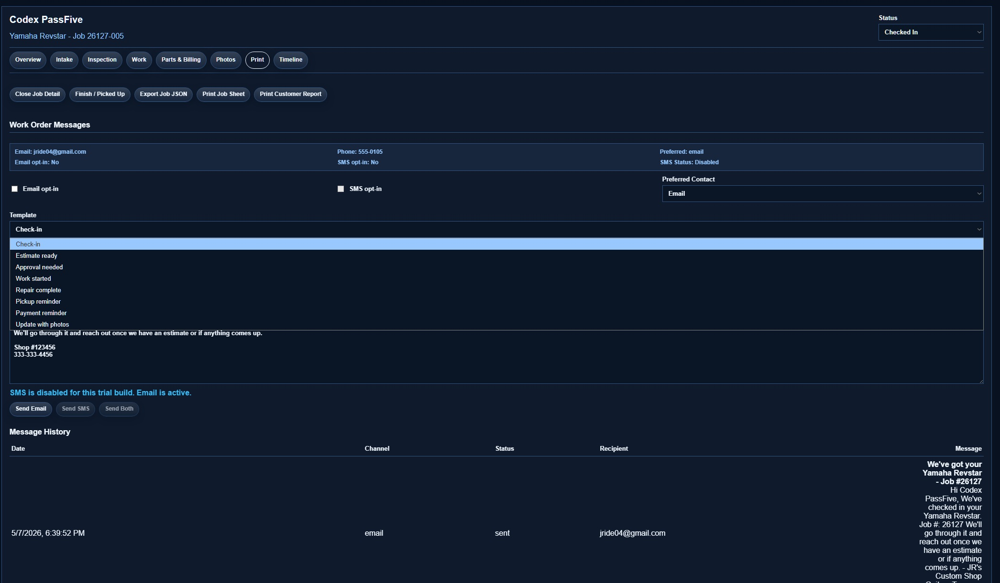

# FretTrack

Current version: `0.2.61`

FretTrack is a guitar and bass repair shop check-in and work order app. It helps a shop track customer intake, instrument details, inspection notes, damage photos, parts, services, payments, customer messages, print paperwork, and job history from drop-off to pickup.

The current `0.2.x` line is a public trial baseline. It is intended for controlled shop testing, not broad unattended production use.

## Screenshots

















## Current Position

- First public trial-ready release.
- Email notifications are active through Supabase Edge Functions and Resend.
- SMS plumbing exists, but SMS is disabled in trial builds until carrier registration is ready.
- Dark theme is the default for new users.
- Work orders, standalone customer records, damage maps, customer lookup, photo handling, payments, print sheets, and activity timeline basics are available.
- Supabase Auth and shop membership foundations are underway; member-management screens and full role-based permissions are still planned.

## Features

- Job intake for acoustic, electric, and bass work.
- Standalone customer add/list/search and repeat-customer quick fill.
- Import-ready customer fields for flexible display names, person/company records, normalized contact matching, structured address, source, external reference, import source, import batch ID, and notes.
- Structured first and last name fields while preserving full-name display.
- Inspection fields for string gauges, neck relief, action, fret condition, neck condition, and notes.
- Damage map with view/area/severity markers and photo attachment support.
- Parts, services, discounts, sales tax, payments, balance, and till summary handling.
- Work log entries that persist immediately.
- Email templates for check-in, estimate, approval, work started, repair complete, pickup reminder, payment reminder, and photo updates.
- Photo upload/gallery flow with HEIC/HEIF conversion support.
- Job print sheet and customer damage report.
- Activity timeline for job creation, updates, status changes, image changes, payments, and work logs.
- Shop settings for local trial branding and print footer text.
- Export Job JSON for trial-shop debugging.
- Supabase Auth sign-in gate for configured trial builds.
- Shop membership foundation for owner/admin/tech/viewer roles.

## Open FretTrack

For normal use, open FretTrack from the desktop shortcut:

```text
FretTrack.lnk
```

If the shortcut is missing or says it cannot find the file specified, run this from the FretTrack folder to recreate it:

```text
Create Desktop Shortcut.cmd
```

You can also launch FretTrack directly from the app folder:

```text
Start FretTrack.cmd
```

## Development

Install dependencies:

```powershell
npm install
```

Start the Vite dev server:

```powershell
npm run dev
```

Open FretTrack in the browser:

```text
http://127.0.0.1:5173/
```

Build the production bundle:

```powershell
npm run build
```

The `:5432` address in `.env` is the Supabase Postgres database port. It is not the browser URL for FretTrack.

If `npm run dev` says port `5173` is already in use, close the old dev server first and run it again. The app is configured with `strictPort: true` so Vite will fail clearly instead of silently moving to another port.

## Environment

Copy `.env.example` to `.env` for local development and fill in your own values.

```powershell
Copy-Item .env.example .env
```

Important:

- `.env` and `.env.*` are intentionally ignored by git.
- Do not commit Supabase service role keys, Resend keys, Twilio tokens, database URLs, JWT secrets, or shop-specific function keys.
- Browser-facing `VITE_*` values are public in built frontend code. Do not put provider secrets or service role keys in `VITE_*` variables.
- `VITE_SUPABASE_ANON_KEY` is public by design. Use Supabase Row Level Security and Edge Function authorization before using real shop data.

## Security

Read [SECURITY.md](SECURITY.md) before making the repository public or connecting real services.

Short version:

- Keep `.env` files private.
- Rotate any Supabase service role key, Resend key, Twilio token, database URL password, JWT secret, or FretTrack function key immediately if it is ever exposed.
- Treat the current shop-level function key as temporary public-trial protection.
- Add proper auth and tighter RLS before broad production use.

## Documentation

- [Changelog](CHANGELOG.md) tracks release-by-release changes.
- [Roadmap](ROADMAP.md) tracks planned product and security work.
- [Known Issues](KNOWN_ISSUES.md) tracks trial limitations, setup traps, and historical fixes.
- [Trial Readiness Checklist](docs/TRIAL_READINESS.md) covers first-shop testing.
- [Architecture Overview](ARCHITECTURE_OVERVIEW.md) explains the main modules and data flow.
- [Supabase Migration Workflow](docs/supabase-migrations.md) explains the migration-history preflight and recovery rules.
- [Docs Home](docs/README.md) links deeper setup and deployment notes.

## Security Automation

This repo includes:

- Dependabot npm updates in `.github/dependabot.yml`.
- A GitHub Actions `npm audit` workflow in `.github/workflows/security.yml`.

Run this locally before publishing or cutting a release:

```powershell
npm audit --audit-level=moderate
npm run check:migrations
npm run build
```

Before creating or applying Supabase migrations, run:

```powershell
npm run check:migrations
```

This fails when the remote database has migration versions missing from `supabase/migrations`, which means local history needs to be recovered before any new migration is pushed.

## License

FretTrack is proprietary software. See [LICENSE](LICENSE).
