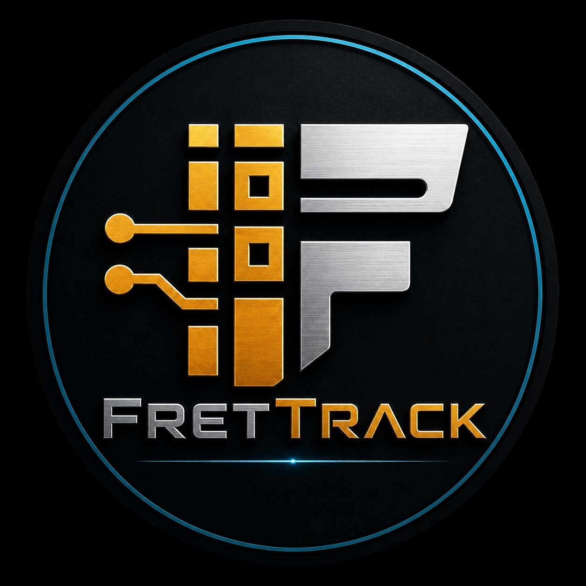

# FretTrack

FretTrack is live at [frettrack-app.com](https://frettrack-app.com).

Current version: `0.2.8-beta.0`

FretTrack is a guitar and bass repair shop check-in and work order system for real bench workflow: customer intake, instrument details, inspection notes, damage photos, parts and services, payments, customer messages, print paperwork, and job history from drop-off to pickup.

## Try Out FretTrack Beta

[Try Out FretTrack Beta](https://frettrack-app.com)

The beta is invite-only. Applications are handled on the live FretTrack site.

## Current Status

Current milestone branch: `v0.2.63 beta candidate`

This includes:

- Customers foundation
- Inventory purchasing foundation with vendors, purchase orders, receiving, purchase history, barcode labels, and transactional receiving RPCs
- Scheduling / Calendar Phase 1
- Premium entitlement foundation and Advanced Reporting Phase 1
- Permission hardening with centralized role checks and granular photo controls
- Operator-managed Shop and Pro trials for 7, 14, or 30 days
- Paid Access Lifecycle Phase 1 with Trial, Shop, and Pro public product boundaries
- Supabase SECURITY DEFINER RPC hardening for beta intake, operator, inventory, accounting, and membership RPCs
- Offline mode audit for the current new-job draft-only continuity scope
- Photo Editor Phase 1 for job-photo markup and manual background cleanup
- Beta approval applicant email notifications
- Jobs, photos, damage map, work logs, accounting foundation, auth/RLS, and multi-shop architecture

Old live baseline:

- `v0.2.6-beta.14` remains the last older live beta baseline before the milestone version ladder.

Product milestone ladder:

- `v0.2.61 beta`: Customers complete
- `v0.2.62 beta`: Inventory complete
- `v0.2.63 beta`: Scheduling complete
- `v0.3.0 beta`: Operational Shop Release

## Recent Beta Updates Since beta6

- Beta access now uses a public application and operator approval flow.
- The public `frettrack-app.com` landing page has been redesigned for launch readiness with a product screenshot hero,
workflow, security, pricing, and beta application sections.
- The landing Worker now includes the FretTrack favicon package and product screenshots as bundled static assets so the
browser tab icon and landing imagery do not depend on manual local files.
- Approved beta users can now receive an access-approved email with the app login URL through the `notify-beta-approval` Supabase Edge Function.
- Customer and subcontractor records are now first-class workflows, not just fields on work orders.
- Work orders and invoices can now be emailed from inside the app.
- Existing work orders now support editable job-level parts and services.
- The app now has mobile/tablet readiness improvements and PWA install support.
- Legacy WebKit compatibility work lets FretTrack load and run on older iPad browser versions, including older iOS Chrome/Brave WebKit shells, with graceful fallbacks instead of black screens.
- New work orders can be saved as local offline drafts and synced manually after reconnecting; this is not full offline mode.
- Inventory purchasing foundation adds stock counts, movements, low-stock visibility, job attachment, vendors, purchase orders, receiving, purchase history, barcode labels, and receiving RPC hardening.
- Scheduling Phase 1 adds internal shop scheduling for due dates, intake appointments, pickups, follow-ups, and shop blocks.
- Unsaved-changes protection now warns before losing manual edits on high-risk forms.
- Premium entitlement checks now centralize future paid-feature gating without blocking core shop workflow.
- Permission checks now centralize operator, owner/admin, tech, viewer, inventory, customer, scheduling, photo, and premium-reporting behavior.
- Photo controls now separate upload, edit, overwrite, delete, and customer-report selection permissions.
- Operators can start, extend, and end 7/14/30-day Shop or Pro trials while beta approval remains separate from paid access.
- Expired trials preserve shop data and memberships, allow login/view access where safe, block writes, and lock premium entitlements.
- Paid Access Lifecycle Phase 1 removes permanent public unpaid-plan wording. Internal `free`, `solo`, and `enterprise` values remain compatibility/fallback values during migration.
- Shop access unlocks Photo Editor and Team Members. Pro access unlocks Advanced Reporting.
- Advanced Reporting Phase 1 adds premium-gated dashboard metrics for revenue, jobs, customers, and inventory.
- Photo Editor Phase 1 adds repair-shop photo markup, captions, crop, brightness, save-as-copy, guarded overwrite, and manual background cleanup.
- Print output has been improved for beta use, with a dedicated print renderer rebuild still planned for the Customer Damage Report and damage-map output.

Legacy device note: older iPadOS/iOS browser versions can be useful for shop-floor testing and light bench workflows, but unsupported operating systems and browsers may no longer receive vendor security patches. Keep devices updated when possible, avoid using unpatched legacy devices for owner/operator administration, and treat them as convenience clients rather than primary security-sensitive workstations.

## Not Included Yet

- Stripe billing or live payment automation.
- Customer self-service subscription management or Stripe-powered billing portal.
- Vendor import/export, external supplier integrations, and broader inventory operations beyond the current purchasing/receiving foundation.
- Full offline mode for existing job edits, queued photo uploads, inventory receiving, purchase orders, or cached authenticated Supabase data.
- Production SMS messaging.
- Public invoice or work-order links.
- Customer-facing appointment confirmations and external calendar sync.
- AI background removal or third-party image cutout APIs.
- Pricing, plan caps, automated billing, or storage enforcement for the Trial/Shop/Pro model.

## Screenshots

## Documentation

- [Changelog](CHANGELOG.md)
- [Roadmap](ROADMAP.md)
- [Release notes](docs/RELEASE_NOTES.md)
- [Photo editor](docs/PHOTO_EDITOR.md)
- [Offline mode audit](docs/OFFLINE_MODE_AUDIT.md)
- [Inventory purchasing notes](docs/INVENTORY_PURCHASING.md)
- [Deployment notes](docs/DEPLOYMENT_NOTES.md)
- [Beta operator dashboard](docs/BETA_OPERATOR_DASHBOARD.md)
- [Subscription foundation](docs/SUBSCRIPTION_FOUNDATION.md)
- [Pricing and tiers](docs/PRICING_AND_TIERS.md)
- [Trial readiness checklist](docs/TRIAL_READINESS.md)
- [Architecture review beta 14](docs/ARCHITECTURE_REVIEW_BETA14.md)
- [Print renderer rebuild plan](docs/PRINT_RENDERER_REBUILD_PLAN.md)
- [Security review checklist](docs/SECURITY_REVIEW_CHECKLIST.md)
- [Supabase migration workflow](docs/supabase-migrations.md)
- [Docs home](docs/README.md)

## Security

Read [SECURITY.md](SECURITY.md) before making repository, deployment, or service-credential changes.

Short version:

- Keep environment files and service credentials private.
- Rotate any exposed Supabase service role key, Resend key, Twilio token, database URL password, JWT secret, or FretTrack function key immediately.
- Treat beta data carefully and keep Supabase Row Level Security enabled for shop-scoped tables.

## License

FretTrack is proprietary software. See [LICENSE](LICENSE).
