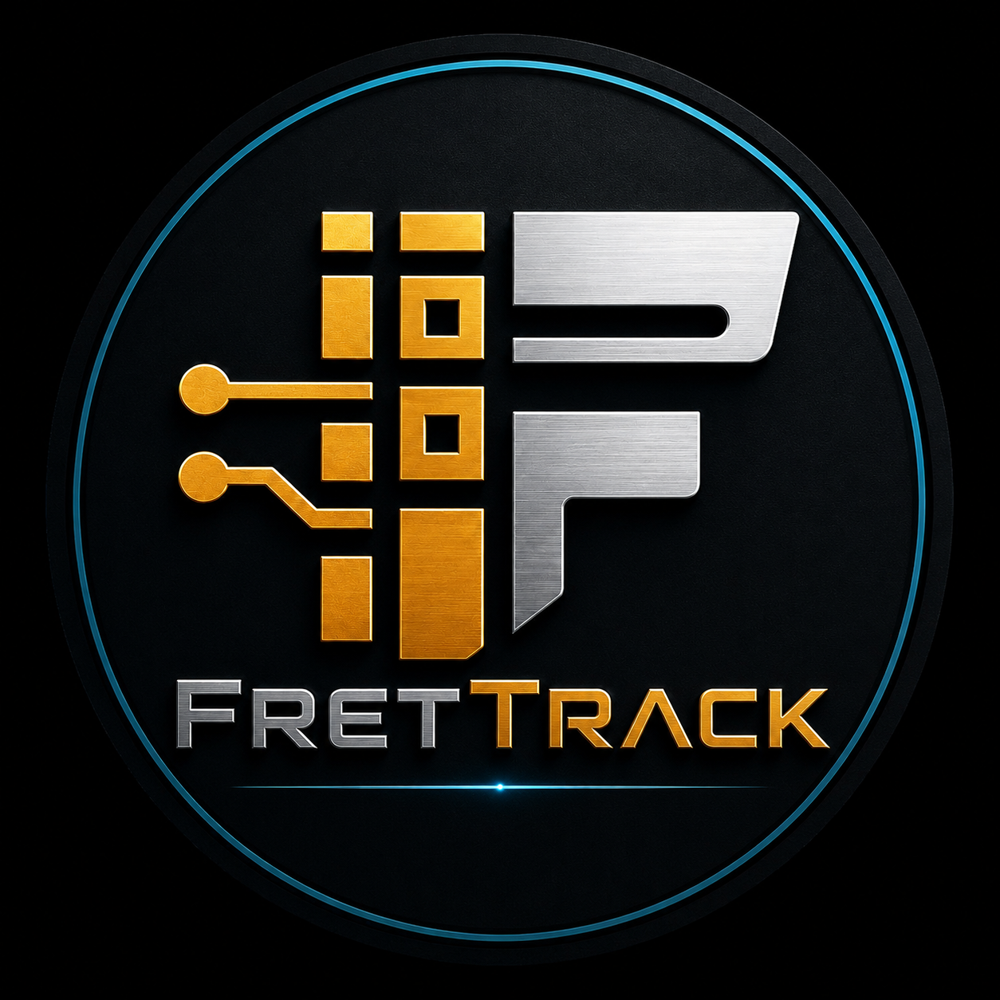
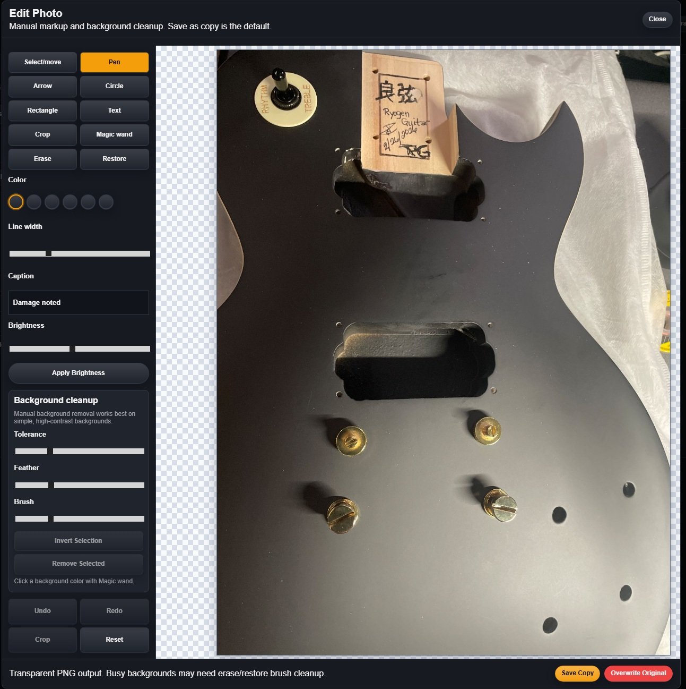

# FretTrack

FretTrack is live at [frettrack-app.com](https://frettrack-app.com).

Current version: `0.2.9`

FretTrack is a guitar and bass repair shop check-in and work order system for real bench workflow: customer intake, instrument details, inspection notes, damage photos, parts and services, payments, customer messages, print paperwork, and job history from drop-off to pickup.

## Try FretTrack

[Request FretTrack Access](https://frettrack-app.com)

New workspaces use controlled approval while onboarding capacity is limited. Applications are handled on the live FretTrack site.

Public customer and workflow-testing docs are available at [frettrack-app.com/docs](https://frettrack-app.com/docs), together with support, privacy, and terms pages.

## Current Status

Current stable release: `v0.2.9`

This includes:

- Customers foundation
- Inventory purchasing foundation with parts, vendors, purchase orders, receiving, purchase history, barcode labels, inbound PO shipping, landed-cost allocation, and transactional receiving RPCs
- Scheduling / Calendar Phase 1
- Premium entitlement foundation and Advanced Reporting Phase 1
- Permission hardening with centralized role checks and granular photo controls
- Operator-managed Shop and Pro trials for 7, 14, or 30 days
- Paid Access Lifecycle Phase 1 with Trial, Shop, and Pro public product boundaries
- Supabase SECURITY DEFINER RPC hardening for account intake, operator, inventory, accounting, and membership RPCs
- Offline mode audit for the current new-job draft-only continuity scope
- Photo Editor Phase 1 for job-photo markup and manual background cleanup
- Account approval applicant email notifications
- Jobs, photos, damage map, work logs, accounting foundation, auth/RLS, and multi-shop architecture
- Pro Team Assignment Foundation with same-shop technician assignment, Current Jobs filtering, workload visibility, audit history, and role-safe self-assignment
- Server-enforced monthly email-recipient, source-photo upload, and current photo-storage caps with Shop Settings usage warnings
- Pro-gated Amplifier and Keyboard Repair workspaces with specialist diagnostics plus the complete parts, services, payments, invoice, print, messaging, scheduling, and history workflow
- Job-linked amplifier and keyboard purchasing with vendor purchase orders, Inventory receiving, package-to-job quantity conversion, and explicit transfer into Parts & Payments
- Pro Scheduled Email with provider-managed delivery, cancellation, consent enforcement, and immutable message snapshots
- Pro Automated Service Reminders with separate customer consent, shop-editable service timing and email copy, a durable Supabase queue, and a nightly dispatcher
- Pro Loyalty Program with paid/completed-work-order stamp awards, reversible eligibility, and an auditable staff redemption ledger
- Hardened Stripe lifecycle ordering, retry safety, and current subscription-period synchronization
- Approved business-use subscription terms: 14-day non-converting Pro trial, Shop at $29.99 monthly / $299.99 yearly, and Pro at $39.99 monthly / $399.99 yearly

### 0.2.9 commercial launch and Pro workflow update

FretTrack 0.2.9 combines the production-hardened Stripe lifecycle and recovery work with Pro Amplifier Repair, Keyboard Repair, Scheduled Email, Automated Service Reminders, and Loyalty workflows. Amplifier and keyboard work orders retain the complete FretTrack commercial workflow and can create job-linked vendor purchase orders, receive parts through Inventory, and move only the required quantity into customer billing. The release preserves existing guitar repair and immediate-email behavior while adding server-authoritative entitlements, shop isolation, consent and quota enforcement, idempotent purchasing and messaging, and focused database/browser coverage. FretTrack is a business-use software service operated by Jeffrey Russell d/b/a Torrance Guitar Repair.

The production database is current through `20260827194500_stripe_webhook_claim_lease_recovery.sql`. The commercial app, public pricing/legal documentation, Stripe billing Edge Functions, live webhook, and customer portal are deployed. New Checkout is open to eligible shop owners and administrators through the reviewed launch gate with required Terms acceptance; Automated Reminder rules remain disabled until a Pro/Enterprise shop explicitly configures and enables one.

### beta.4 architecture and reliability upgrade

FretTrack's working screens now sit behind clearer feature boundaries instead of continuing to accumulate inside a few oversized application files. Workspace navigation, the New Job sidebar, Inventory lists/editors/purchase orders, and Job Detail inspection/work/printing/billing sections have been separated into focused modules while preserving their existing handlers, permissions, dirty-state protection, and database behavior.

This is intentionally an internal reliability upgrade rather than a visual redesign. It reduces the amount of unrelated code involved in future changes, lazy-loads top-level workspaces, and adds focused regression coverage around the new boundaries. Refresh restoration was hardened so the selected workspace or valid Job Detail survives authenticated startup.

Inventory reliability was also tightened: direct receiving, stock adjustments, and purchase-order receiving now refresh the selected part editor from the saved stock result. Clicking **Save Changes** afterward no longer writes an older quantity back over received or adjusted stock. Local development is now explicitly isolated from hosted Supabase by default so fictional test work cannot silently mutate a live shop.

Historical beta baseline:

- `v0.2.6-beta.14` was the earlier baseline before the current milestone release line.

Product milestone ladder:

- `v0.2.61 beta`: Customers complete
- `v0.2.62 beta`: Inventory complete
- `v0.2.63 beta`: Scheduling complete
- `v0.3.0 beta`: Operational Shop Release

## Recent Product Updates

- Account access uses a public application and operator approval flow.
- The public `frettrack-app.com` landing page has been redesigned for launch readiness with a product screenshot hero,
workflow, security, pricing, and access application sections.
- The landing Worker now includes the FretTrack favicon package and product screenshots as bundled static assets so the
browser tab icon and landing imagery do not depend on manual local files.
- Approved users can receive an access-approved email with the app login URL through the existing access-notification Supabase Edge Function.
- Customer and subcontractor records are now first-class workflows, not just fields on work orders.
- Work orders and invoices can now be emailed from inside the app.
- Existing work orders now support editable job-level parts and services.
- The app now has mobile/tablet readiness improvements and PWA install support.
- Legacy WebKit compatibility work lets FretTrack load and run on older iPad browser versions, including older iOS Chrome/Brave WebKit shells, with graceful fallbacks instead of black screens.
- New work orders can be saved as local offline drafts and synced manually after reconnecting; this is not full offline mode.
- Inventory purchasing foundation adds stock counts, movements, low-stock visibility, job attachment, vendors with Company/Sales Rep/address/Online Only fields, purchase orders, receiving, purchase history, barcode labels, inventory Location/Category presets, UPC-facing labels, Special Order Part handling, small part images, inbound PO shipping cost, optional landed-cost allocation, and receiving RPC hardening.
- Scheduling Phase 1 adds internal shop scheduling for due dates, intake appointments, pickups, follow-ups, and shop blocks.
- Unsaved-changes protection now warns before losing manual edits on high-risk forms.
- Premium entitlement checks now centralize future paid-feature gating without blocking core shop workflow.
- Permission checks now centralize operator, owner/admin, tech, viewer, inventory, customer, scheduling, photo, and premium-reporting behavior.
- Photo controls now separate upload, edit, overwrite, delete, and customer-report selection permissions.
- Operators can start, extend, and end 7/14/30-day Shop or Pro trials while account approval remains separate from paid access.
- Expired trials preserve shop data and memberships, allow login/view access where safe, block writes, and lock premium entitlements.
- Paid Access Lifecycle Phase 1 removes permanent public unpaid-plan wording. Internal `free`, `solo`, and `enterprise` values remain compatibility/fallback values during migration.
- Shop access keeps the paid core workflow active. Pro access unlocks Photo Editor, Team Members, and Advanced Reporting.
- Pro Reports Dashboard Phase 2 adds Pro-gated operational reporting for shop overview, job status, priority, overdue promise dates, pickup readiness, waiting-on-parts work, job aging, work-log activity, low stock, purchase order status, landed-cost purchase history, and upcoming schedule workload.
- Pro plan branding/status UI now keeps Trial Pro and Pro shops on the FretTrack Pro emblem and Pro labels, including monthly/yearly, canceling, renewal, access-ending, and expired countdown states.
- Workflow-testing workbook/checklist downloads and public Terms, Privacy, and Support pages are available from the public site.
- Photo Editor Phase 1 adds repair-shop photo markup, captions, crop, brightness, save-as-copy, guarded overwrite, and manual background cleanup.
- Print output has been improved for shop use, with a dedicated print renderer rebuild still planned for the Customer Damage Report and damage-map output.

Legacy device note: older iPadOS/iOS browser versions can be useful for shop-floor testing and light bench workflows, but unsupported operating systems and browsers may no longer receive vendor security patches. Keep devices updated when possible, avoid using unpatched legacy devices for owner/operator administration, and treat them as convenience clients rather than primary security-sensitive workstations.

## Not Included Yet

- Vendor import/export, external supplier integrations, vendor returns, inventory forecasting, outbound/customer shipping, carrier labels, and tracking numbers.
- Full offline mode for existing job edits, queued photo uploads, inventory receiving, purchase orders, or cached authenticated Supabase data.
- Production SMS messaging.
- Public invoice or work-order links.
- Customer-facing appointment confirmations and external calendar sync.
- AI background removal or third-party image cutout APIs.
- Paid usage overages, public self-service account deletion, or multi-shop subscription management.

## Screenshots

## Documentation

- [Changelog](CHANGELOG.md)
- [Roadmap](ROADMAP.md)
- [Release notes](docs/RELEASE_NOTES.md)
- [Public docs hub](https://frettrack-app.com/docs)
- [Photo editor](docs/PHOTO_EDITOR.md)
- [Offline mode audit](docs/OFFLINE_MODE_AUDIT.md)
- [Inventory purchasing notes](docs/INVENTORY_PURCHASING.md)
- [Deployment notes](docs/DEPLOYMENT_NOTES.md)
- [Beta operator dashboard](docs/BETA_OPERATOR_DASHBOARD.md)
- [Subscription foundation](docs/SUBSCRIPTION_FOUNDATION.md)
- [Pricing and tiers](docs/PRICING_AND_TIERS.md)
- [Trial readiness checklist](docs/TRIAL_READINESS.md)
- [Architecture review beta 14](docs/ARCHITECTURE_REVIEW_BETA14.md)
- [Print renderer rebuild plan](docs/PRINT_RENDERER_REBUILD_PLAN.md)
- [Security review checklist](docs/SECURITY_REVIEW_CHECKLIST.md)
- [Supabase migration workflow](docs/supabase-migrations.md)
- [Docs home](docs/README.md)

## Security

Read [SECURITY.md](SECURITY.md) before making repository, deployment, or service-credential changes.

Short version:

- Keep environment files and service credentials private.
- Rotate any exposed Supabase service role key, Resend key, Twilio token, database URL password, JWT secret, or FretTrack function key immediately.
- Treat production customer data carefully and keep Supabase Row Level Security enabled for shop-scoped tables.

## License

FretTrack is proprietary software. See [LICENSE](LICENSE).
