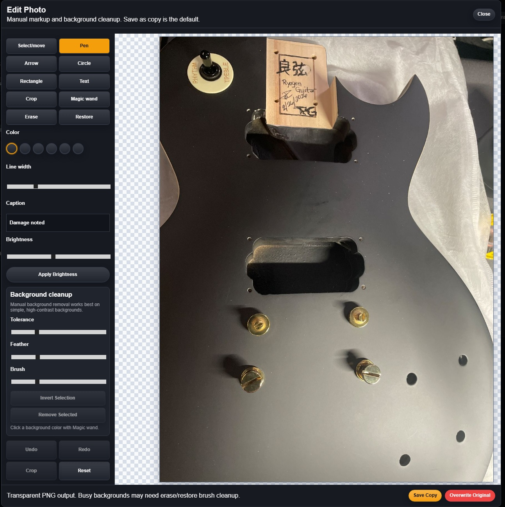

# Release Notes

## GitHub Release Summary: v0.2.9-beta.0

FretTrack `0.2.9-beta.0` moves the beta into paid-release preparation: Pro Reports Dashboard Phase 2, Pro plan branding/status UI hardening, FretTrack Pro emblem support, Trial Pro / Pro identity display, plan countdown/status handling, beta tester workbook/checklist delivery, public Terms / Privacy / Support readiness, Customer Import preview safety, outbound Shipping Foundation, and the existing Trial/Shop/Pro entitlement foundation. Stripe Checkout, Customer Portal, billing webhooks, subscription sync, and live payment collection are next, not live in this release.

## 0.2.9-J Live Demo Bug Polish

Live-demo polish tightens the day-one beta experience without adding Stripe or new feature surfaces. New Job intake now keeps customer phone/email/address/city/state/zip in the saved job payload so reopening Intake repopulates the fields, instrument type persists through save/reopen, and string gauge presets now cover Electric, Acoustic, Bass, and Nylon/Classical categories.

Plan wording and gates now match the current product model: Shop is the paid core workflow, while Photo Editor, Team Members, and Advanced Reporting are Pro-only upgraded features. The Photos and Shop Settings lock states now say `Available in Pro`, Shop no longer advertises a two-user limit, and the entitlement check script enforces the Pro-only boundary.

The pass also fixes small live-demo UI annoyances: Billing/Customers/Scheduling header navigation stays highlighted for the active page, Scheduling date/time fields stay inside the Add/Edit Event form, and long customer emails wrap instead of spilling out of customer cards/details.

## 0.2.9-A Pro Reports Dashboard Phase 2

Advanced Reporting now has a Pro-gated operational dashboard built from existing shop data. Pro-enabled shops can review shop overview counts, jobs by status, priority breakdowns, overdue promise dates, ready-for-pickup work, waiting-on-parts work, job aging, recent work-log activity, low-stock parts based on desired stock levels, open purchase orders, purchase history with landed-cost fields, and upcoming schedule workload.

This pass does not add charts, exports, PDFs, Stripe, Checkout, Billing Portal, payment links, webhooks, SMS, public document links, or supplier integrations. Shop and expired-trial lock states continue to rely on the existing entitlement and paid-access lifecycle foundation.

## 0.2.9-D Reports Export, Print, And Large Dataset Safety

Pro Reports now include browser print support, per-section CSV export buttons, a summary CSV export, simple status/date filters for job status summary, recent work-log activity, and purchase history, and section-level error containment so one broken report section does not trigger the global app fallback.

Large dataset safety is now explicit: table previews show 25 rows by default, `Show all visible rows` is available only when a section has 250 rows or fewer, CSV exports are capped at 1,000 rows, and the reports check script exercises a 1,500-row mock dataset plus CSV escaping for commas, quotes, and newlines.

This pass does not add PDF generation dependencies, charts, scheduled report emails, Stripe revenue analytics, or server-side report aggregation RPCs. Browser print / Save as PDF is the current printable output path.

## 0.2.9-F Customer Import Parser + Template Foundation

Customer import has been rebuilt as a narrow parser/template foundation after the reverted all-in-one MVP. This pass adds the public CSV template, an isolated PapaParse-backed preview helper, alias mapping for common customer-list headers, first/last name combination, required-name and email validation, duplicate detection within a file, existing-customer duplicate warnings when records are supplied to the helper, skipped/error CSV output, and `npm run check:customer-import` coverage.

This pass intentionally does not add a Customers page import button, import modal, import route, Supabase calls, customer database writes, customer service changes, App.jsx changes, XLSX support, vendor import, inventory import, rollback behavior, or deployment changes. Owner/Admin preview UI and write-enabled import are planned later after parser behavior has been tested safely.

## 0.2.9-G Customer Import Preview UI

The Customers module now includes an Owner/Admin-only CSV Import Preview panel. Owners and admins can download the template, upload a CSV, preview mapped and normalized customer rows, review required-name and email validation errors, see duplicate warnings, and download skipped/error rows as CSV. Large-file safety is intentionally boring: the visible table is capped at 100 rows and files over 1,000 nonblank rows are blocked from preview.

This pass still does not add customer database writes, an active import/save button, Supabase calls, customer service changes, migrations, XLSX support, vendor import, or inventory import. Write-enabled customer import remains a later phase after preview testing.

## 0.2.9-H Shipping Foundation

FretTrack now has the database and service foundation for outbound job/customer shipping. The new `job_shipments` table stores shop-scoped shipment records linked to jobs and optional customers, with direction, pickup/ship fulfillment method, shipment status, carrier/service/tracking fields, shipping cost/charge fields, shipped/delivered timestamps, and ship-to address snapshots so shipment history stays accurate even if a customer address later changes.

This pass adds RLS using existing shop membership and write-access helpers, keeps hard deletes out of normal user access, adds narrow shipment permission helpers, and adds `npm run check:shipping` coverage. It does not add shipping UI, carrier APIs, label/rate purchasing, Stripe integration, email/SMS automation, or shipping reports. Manual tracking/status UI is planned next.

## 0.2.9-I Shop Bootstrap Reliability

First-shop creation now uses the bootstrap RPC as the single authority for creating the shop profile, owner membership, and default trial subscription in one transaction. The RPC still requires an authenticated user, confirmed email, and approved beta access or operator status, keeps `SECURITY DEFINER` with a locked search path, and does not disable or loosen RLS.

After the RPC succeeds, the frontend reloads real shop access, profile, and entitlement state before letting the user continue. It no longer fakes the final membership or entitlement snapshot locally, which avoids the partial-shop state that could lead to follow-up RLS errors after a new user created their first shop.

## 0.2.9-B0 Plan Branding And Subscription Status UI Foundation

FretTrack now has a centralized plan-status normalizer for Trial, Shop, Pro, Free/internal compatibility, expired, canceled, past-due, and unknown billing states. The app header, version area, Shop Settings subscription panel, Billing page, and Advanced Reporting lock/unlock state now use the same plan labels and countdown wording for trial ends, renewals, access-ending states, and expired access.

Pro-enabled shops and Pro trials now use the Pro emblem asset plus Pro labels as their primary identity. They must not fall back to `FretTrack Shop`, `Shop`, or the standard Shop emblem except in comparison copy such as "Pro includes everything in Shop." Shop, Trial Shop, expired, inactive, and internal Free compatibility states keep the original FretTrack emblem. Shop Settings now includes a Plan / Subscription section with current plan, billing interval, status, trial end, current period end, countdown, Advanced Reporting availability, locked premium feature count, and disabled Manage Billing / Upgrade Plan placeholders.

The display states are covered by `npm run check:plan-branding`: Trial Shop, Trial Pro, Shop Monthly, Shop Yearly, Pro Monthly, Pro Yearly, canceling Pro with active access, and Expired.

This pass does not add Stripe Checkout, Customer Portal, webhooks, billing routes, billing secrets, pricing enforcement, or payment collection. Stripe billing integration remains the next pass.

## Public Launch Site Refresh - In Progress

The public `frettrack-app.com` landing Worker has been redesigned around a launch-ready SaaS page: product screenshot
hero, repair-shop workflow, security posture, Trial/Shop/Pro pricing preview, and the existing beta application form.
The Worker now bundles the favicon package and landing screenshots through a static asset binding so the browser tab
icon and product imagery deploy with the public site.

## 0.2.8 UI Polish

- The New Job section menu can now be collapsed to give the form more working space, with the preference saved per browser.
- New Job and Job Detail instrument intake now use cascading Instrument Type / Brand / Model suggestions, with brand-matched model options and custom brand/model entry still allowed.
- New Job instrument intake now has improved Serial Number/Color labels and placeholders, optional Year/Finish/Orientation details, a cleaner grouped layout for screenshots and real shop intake, no extra Brand/Model helper copy, and a compact Year field.

## 0.2.8-D Vendor And Landed-Cost Purchasing Polish

- Vendor UI now uses Company and Sales Rep labels while preserving the existing `vendors.name` and `vendors.contact_name` data model.
- Vendors can store address fields and can be marked Online Only, which collapses phone/address fields without clearing existing values.
- Purchase Orders now support inbound vendor Shipping Cost and an optional Add shipping to cost flag.
- Purchase-order receiving can allocate remaining shipping proportionally across received line subtotals and store base unit cost, shipping allocated, and landed unit cost on receipt items.
- Partial receipts allocate only remaining unallocated shipping, preventing shipping from being double-counted across multiple receives.
- Purchase History now shows unit cost, shipping allocated, landed unit cost, and total landed cost where available.
- Outbound customer shipping, carrier integrations, labels, tracking numbers, and shipment notifications remain future scope.

## 0.2.8 Inventory Purchasing Foundation

This foundation pass starts the 0.2.8 Inventory Operations Release without adding SMS, public document links, calendar sync, or broad offline mode.

### Added

- Shop-scoped vendors with contact details and active/inactive state.
- Purchase orders with draft, ordered, partially received, received, and cancelled states.
- Purchase order items with part links, descriptions, vendor SKU, ordered quantity, received quantity, and unit cost.
- Inventory receipts and receipt items for manual receives and purchase-order receives.
- Transactional receiving RPCs so stock increases, cost updates, receipt rows, purchase order received quantities, purchase order status, and `part_movements` history are written together.
- Part fields for vendor link, vendor SKU, barcode code, desired stock level, last cost, and average cost while preserving existing supplier/manufacturer/part number/unit cost/retail/quantity/reorder/location data.
- Inventory UI tabs for Parts, Vendors, Purchase Orders, and Purchase History.
- Stable barcode identity display/search using `FT-PART-{barcode_code}` without adding a barcode rendering package yet.
- Printable browser-based barcode label sheets using CODE128 barcodes through `jsbarcode`.
- Barcode search now handles both `FT-PART-{barcode_code}` and raw barcode code values.
- Purchase Orders now show status filters, expected and received dates, ordered/received/remaining quantities, receipt counts, estimated cost, and clear Mark Ordered / Cancel / Receive actions.
- Purchase History now shows date, part, vendor, PO, receipt reference, quantity, unit cost, total cost, received-by reference, and notes.
- Receiving RPCs now enforce stricter cost and quantity bounds while preserving transactional stock, receipt, and movement writes.

### Still Not Included

- Vendor import/export.
- Offline receiving or offline inventory conflict handling.
- SMS, public invoice/work-order links, or external calendar sync.

## 0.2.8 Hotfix: Purchase Order Items Create Inventory Parts

Purchase order line items now create or link a real shop inventory part before receiving. New PO-created parts start with `quantity_on_hand = 0`, receive a barcode identity through the existing part barcode trigger, and become searchable in inventory immediately. Receiving the PO then increments that linked part, writes receipt history, and records the `receive` movement.

The receive RPC also repairs older purchase order items with `part_id = null` when the line has enough description data to create the missing inventory part safely. It still rejects cancelled purchase orders, over-receiving, invalid quantities, invalid costs, and unauthorized/shop-mismatched writes.

Inbound PO shipping and landed-cost allocation are now covered by the 0.2.8-D purchasing polish pass. Outbound customer shipping, carrier labels, tracking numbers, and shipping notifications remain future work and are not part of this hotfix.

## 0.2.8-C Offline Mode Audit And Version Sync

This pass syncs the visible release version to `0.2.8-beta.0` and documents the current offline boundary clearly. FretTrack supports new-job intake draft continuity only; it does not support full offline database sync.

### Added

- Package metadata, lockfile metadata, app version display, README, changelog, release notes, and trial readiness references now point at `0.2.8-beta.0`.
- `docs/OFFLINE_MODE_AUDIT.md` documents what works offline, what does not, where local draft data lives, refresh behavior, reconnect behavior, known risks, and the future offline architecture.
- User-facing offline wording now says offline draft mode is for new job intake only.

### Current Offline Scope

- New job intake drafts can be saved locally in IndexedDB when the browser or Supabase connection is unavailable.
- Drafts are reviewed in Local Drafts and synced manually after reconnecting.
- Existing job edits, photo uploads, inventory receiving, purchase orders, and broad authenticated data sync remain online-only.

### Future Offline Architecture

Full offline support will need an offline outbox, idempotency keys, server-side conflict detection, sync status, retry queues, photo upload queues, inventory mutation safeguards, stock receiving conflict handling, and audit logging before inventory receiving can be safely taken offline.

## GitHub Release Summary: v0.2.6-beta.14 Updates Since beta6

FretTrack has moved from the beta6 operations/storage baseline to a broader real-shop beta focused on access control, customer workflow, email documents, mobile readiness, editable billing details, inventory, scheduling, reporting foundations, premium trial management, safer editing, photo documentation, and first-pass offline continuity.

### Highlights Since beta6

- Beta access is now gated by an application and operator approval flow instead of automatically opening a shop workspace for every new sign-in.
- Approved beta users can now receive an approval email with the app login URL through the `notify-beta-approval` Supabase Edge Function.
- The internal operator dashboard now supports approval workflows, shop/member/usage visibility, beta-bypass handling, Shop/Pro trial start/extension/end controls, and status controls.
- Customer and subcontractor management are now first-class beta workflows, including profiles, balances, payment history, customer creation, and CRM-style lookup.
- Work orders and invoices can now be emailed from inside FretTrack through the authenticated Supabase Edge Function and Resend path.
- Existing work orders now support editable job-level parts and services while preserving totals, discounts, tax/VAT, payments, invoice summaries, and print output.
- Inventory operations now cover shop-scoped parts, stock counts, job attachment, stock movement rows, low-stock indicators, vendors, purchase orders, receiving, purchase history, barcode labels, inbound PO shipping, landed-cost allocation, and viewer-safe write controls.
- Scheduling / Calendar Phase 1 now covers internal schedule events, job due dates, intake appointments, pickup appointments, follow-ups, shop blocks, filters, and Job Detail scheduling.
- Premium entitlement architecture, operator-managed Shop/Pro trial controls, Shop Tier Foundation Phase 1, Paid Access Lifecycle Phase 1, and Advanced Reporting Phase 1 are in place without enabling Stripe, billing collection, self-service subscriptions, charts, exports, or PDFs.
- Permission hardening now centralizes operator/shop-role checks and separates photo upload, edit, overwrite, delete, and customer-report selection permissions.
- Public product wording is now Trial, Shop, and Pro. Internal `free`, `solo`, and `enterprise` values remain compatibility/fallback values during migration.
- Expired trials now preserve data and memberships, allow safe viewing, block writes, and lock premium entitlements until access is restored.
- Unsaved-changes protection now warns before losing manual edits in the first high-risk areas.
- Photo Editor Phase 1 now supports repair-shop image markup, text captions, crop, brightness, save-as-copy, guarded overwrite, and manual background cleanup.
- Mobile and tablet readiness improved with responsive layout work, touch-friendlier controls, camera-first photo capture, and installable PWA support.
- Offline continuity now covers new work order drafts with an IndexedDB-backed local queue, manual sync, discard, and last-error visibility.
- Print readability improved, but the Customer Damage Report and damage-map print system are still scheduled for a dedicated renderer rebuild.

### Still Not Included

- Stripe billing or live payment automation.
- Customer self-service subscription management.
- Vendor import/export, supplier integrations, vendor returns, outbound/customer shipping, carrier labels, tracking numbers, and deeper inventory forecasting beyond the current vendors / purchase orders / receiving / barcode label / landed-cost foundation.
- Full offline mode for existing job edits, photo queues, inventory receiving, purchase orders, or cached authenticated Supabase data.
- SMS production messaging.
- Public invoice/work-order links.
- AI background removal or third-party image cutout APIs.

### Screenshots

## v0.2.6-beta.14

This beta adds the first safe offline continuity layer for intake days when the shop internet or Supabase connection goes sideways. It does not attempt full offline mode yet. Instead, new work orders can be saved as local drafts, reviewed clearly, and synced manually when the connection returns.

### Added

- Offline status chip and banner with clear local-draft messaging.
- IndexedDB-backed local draft queue for new work orders.
- Offline fallback for new job saves when network or remote save fails.
- Pending Local Drafts review screen with sync, discard, and last-error visibility.
- Manual one-at-a-time draft sync flow to avoid aggressive background syncing.

### Notes

- Beta 14 supports offline continuity for new work orders only.
- Existing remote job edits are still online-only and are clearly marked as unsupported while offline.
- Photos are not queued offline yet. Drafts can be synced first and images added after reconnecting.
- Local drafts are continuity protection for bench workflow, not a backup system.

### Not Included

- Full offline database
- Automatic background sync
- Offline edits to existing jobs
- Offline photo/blob queue
- Cached authenticated Supabase API data

## v0.2.6-beta.13

This beta makes FretTrack feel much better on phones and tablets without splitting the product into a second app. It adds installable PWA support, touch-friendlier layout behavior, and a faster camera-first photo workflow for bench use.

### Added

- PWA install support with manifest, service worker, and install prompt handling.
- iPhone/iPad install guidance banner for Add to Home Screen workflow.
- Mobile-friendly header/action layout and detail-first app layout behavior on smaller screens.
- Camera-first upload controls for job photos and damage-map view images.
- Touch-friendlier responsive controls for mobile and tablet use.

### Notes

- This is still the same React app, not a separate mobile site or native mobile app.
- The service worker is intentionally lightweight and focused on installability and shell caching, not offline job editing yet.
- Direct camera capture now sits alongside normal device import so shops can work faster at intake without losing the existing file picker flow.

### Not Included

- Separate mobile site
- React Native app
- Second codebase
- Railway backend

## v0.2.6-beta.12

This beta tightens up the day-to-day billing workflow by making job-level parts and services fully editable on the work order while preserving totals, payments, print output, and invoice email summaries.

### Added

- Editable parts rows on work orders.
- Editable services/labor rows on work orders.
- Clear add/remove controls for job-level parts and services.
- Read-only-safe parts/services UI that respects shop role and billing state.

### Notes

- This is still job-level editing only, not the future inventory module.
- Totals, discounts, tax, balance due, invoice emails, and print sheets now continue reflecting edited part and service values.
- Payment history behavior is unchanged.

### Not Included

- Inventory catalog
- Vendor management
- Stock tracking
- SKU database
- Purchase orders
- Reorder levels

## v0.2.6-beta.11

This beta adds in-app email workflow for work orders and invoice summaries so shops can send customer-ready documents without leaving FretTrack.

### Added

- Email Work Order action from Job Detail.
- Email Invoice action from the billing/totals workflow.
- Email preview modal with editable recipient, subject, and message body.
- Work order and invoice email summaries using existing Supabase Edge Function and Resend delivery flow.
- Job event logging for `work_order_emailed` and `invoice_emailed`.

### Notes

- Customer and subcontractor email sending uses the existing authenticated `send-email` Edge Function path.
- Recipient validation now blocks send when the selected customer or subcontractor has no valid email address.
- Email Statement remains a future customer-profile follow-up rather than part of this release.

### Known Issues

- Customer Damage Report print layout still requires redesign.
- Damage-map print rendering is inconsistent across print preview/browser flows.
- Visual damage-map print markers are temporarily disabled in production print output.
- Dedicated print renderer planned.

## v0.2.6-beta.10

This beta release promotes the new customer and subcontractor CRM workflow to a full beta milestone while documenting remaining print-system instability.

### Added

- Customer/Subcontractor management module.
- Customer profiles.
- Customer balances and payment history.
- CRM-style customer workflow.
- Customer creation modal.
- Mobile/tablet responsive improvements.
- Beta access workflow improvements.
- Email notification workflow.

### Known Issues

- Customer Damage Report print layout still requires redesign.
- Damage-map print rendering is inconsistent across print preview/browser flows.
- Visual damage-map print markers are temporarily disabled in production print output.
- Dedicated print renderer planned.

### Roadmap Note

- Replace current damage-map print approach with dedicated print-only renderer.
- Separate screen interaction rendering from printable report rendering.
- Rebuild visual print marker rendering behind screenshot checkpoints before re-enabling.

## v0.2.6-beta.9

FretTrack beta is getting sturdier for real shop use. This release tightens access, improves operator control, and makes the app friendlier on mobile and in print.

### Highlights

- Beta access approval gate so new sign-ins do not automatically enter a shop workspace.
- Operator approval workflow in the internal dashboard.
- Landing page beta application flow that creates real beta access requests.
- Email notifications for beta applications.
- Mobile and tablet responsive improvements across core screens.
- Print output improvements for job sheets and customer reports.
- Security and access hardening around beta onboarding and workspace bootstrap.

### Notes for beta testers

- Approved beta users should continue to sign in and work normally.
- Pending users will see an approval screen until an operator approves access.
- Print sheets should now be darker and easier to read.
- The app remains focused on repair workflow, not billing automation.

### GitHub summary

- Access control: beta approval requests and operator approvals.
- UX: better landing page application, mobile/tablet layout, and print readability.
- Stability: security/access hardening with no Stripe or billing automation added yet.
